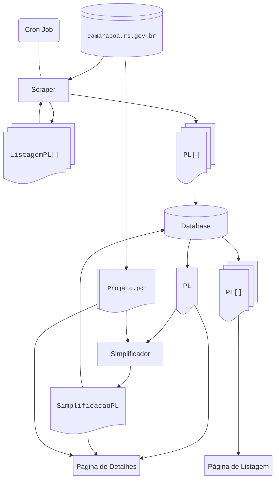

## Diagrama de fluxo de dados

```mermaid
graph
    Camara@{ shape: lin-cyl, label: "<pre>camarapoa.rs.gov.br</pre>" }
    CronJob@{ shape: event, label: "Cron Job" }
    ListagensPL@{ shape: docs, label: "<pre>ListagemPL[]</pre>" }
    PLs@{ shape: docs, label: "<pre>PL[]</pre>" }
    PLs2@{ shape: docs, label: "<pre>PL[]</pre>" }
    DB@{ shape: db, label: "&nbsp;&nbsp;&nbsp;&nbsp;&nbsp;&nbsp; Database &nbsp;&nbsp;&nbsp;&nbsp;&nbsp;&nbsp;" }
    PL@{ shape: doc, label: "<pre>PL</pre>" }
    PDF@{ shape: lin-doc, label: "<pre>Projeto.pdf</pre>" }
    SimplificacaoPL@{ shape: doc, label: "<pre>SimplificacaoPL</pre>" }
    FrontListagem@{ shape: div-rect, label: "Página de Listagem" }
    FrontDetalhes@{ shape: div-rect, label: "Página de Detalhes" }

    Camara --> Scraper
    CronJob e1@--- Scraper
    Scraper --> ListagensPL
    ListagensPL --> Scraper
    Scraper --> PLs
    PLs --> DB
    DB --> PL
    PL --> Simplificador
    Camara --> PDF
    PDF --> Simplificador
    Simplificador --> SimplificacaoPL
    SimplificacaoPL --> DB
    DB --> PLs2
    PLs2 ----> FrontListagem
    PL --> FrontDetalhes
    SimplificacaoPL --> FrontDetalhes
    PDF --> FrontDetalhes

    e1@{ animate: true }
    classDef text-sm font-size:0.875rem
    classDef text-lg font-size:0.875rem
    class Camara,PDF text-sm
```
